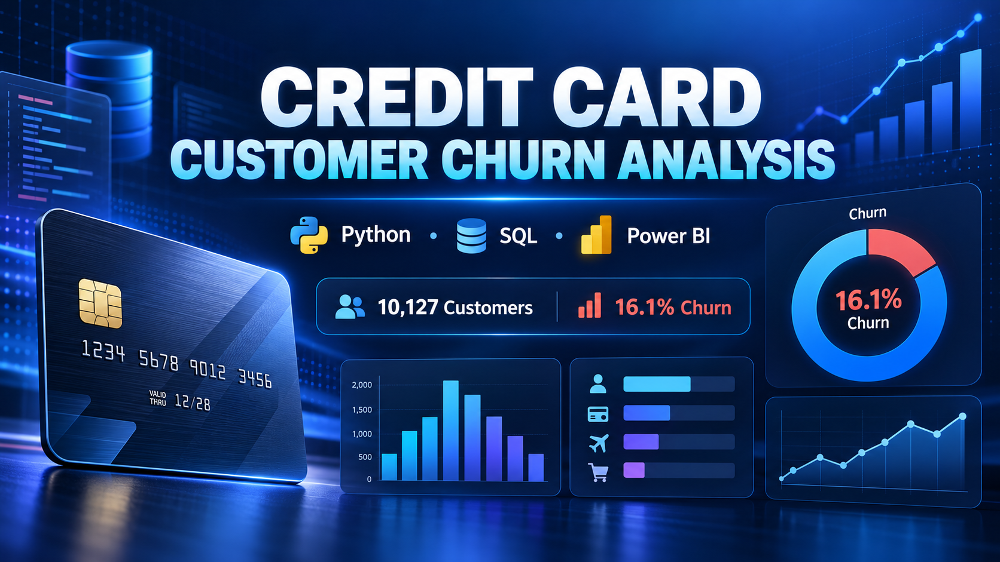

# dataanalyticsproject
credit card customer churn analysis using pandas sql power bi



# Credit Card Customer Churn Analysis

## Project objective

This project analyses credit-card customer churn to identify customer segments and behavioural patterns associated with attrition. The goal is to help a bank monitor churn, prioritize existing customers who may need retention attention and support evidence-based retention campaigns.

The analysis identifies associations, not causes. A higher churn rate within a group does not prove that the group characteristic caused customers to leave.

## Business questions

- What is the overall customer churn rate?
- Which card, income and demographic groups have higher observed churn rates?
- How are inactivity, customer contacts, product relationships, transactions and utilization associated with churn?
- Which existing customers should be prioritized for retention outreach?

## Tools used

- **Python:** Pandas and NumPy for cleaning, feature engineering and validation
- **SQL:** MySQL 8 for business analysis queries
- **Power BI:** data modelling, DAX measures, interactive visuals and retention reporting
- **GitHub:** version control and project documentation

## Dataset

The analysis uses the public `BankChurners.csv` credit-card customer dataset. It contains customer demographics, account relationships, inactivity, contact history, credit utilization, transaction activity and `Attrition_Flag`.

Expected validation totals:

| KPI | Result |
| --- | ---: |
| Total customers | 10,127 |
| Existing customers | 8,500 |
| Churned customers | 1,627 |
| Churn rate | 16.1% |

Add the exact dataset source URL here before publishing the repository. Do not upload the raw CSV unless its licence allows redistribution.

## Data cleaning and feature engineering

The Python workflow:

1. Standardizes column names and text values.
2. Removes missing customer IDs and duplicate `CLIENTNUM` records.
3. Removes the two `Naive_Bayes_Classifier` model-output columns to avoid leakage and irrelevant analysis.
4. Converts `Attrition_Flag` into a numeric `Churn_Flag`.
5. Creates `Age_Group`, `Tenure_Years`, `Avg_Transaction_Value`, `Utilization_Band` and `Risk_Segment`.
6. Exports the cleaned dataset for SQL and Power BI.
7. Calculates grouped churn tables to validate dashboard results.

## Power BI report pages

### 1. Executive Overview

- KPI cards: total, existing and churned customers, plus churn rate
- Churn rate by card category
- Churn rate by income category
- Customers by attrition status

### 2. Customer Profile

- Churn rate by age group
- Attrition distribution by gender
- Churn rate by education level
- Churn rate by marital status

### 3. Customer Behaviour

- Churn rate by inactive months
- Churn rate by contact count
- Churn rate by number of bank products
- Transaction count versus transaction amount by churn status
- Churn rate by utilization band

### 4. Retention Actions

- Customer-level risk table
- Conditional formatting
- Risk, card, income and gender slicers
- Drill-through and report-page tooltips
- Reset-filter bookmark

## Key findings

- Overall churn is approximately 16.1%, representing 1,627 of 10,127 customers.
- Churn rates vary across card, income, demographic and behavioural segments.
- Contact count and inactivity show visible churn patterns, but extreme rates in small groups must be interpreted with their customer counts.
- Transaction activity and utilization help distinguish engagement patterns between existing and attrited customers.

## Recommendations

- Prioritize high-risk existing customers for re-engagement outreach.
- Use transaction-based offers for customers showing declining activity.
- Review repeated-contact cases for unresolved service problems.
- Test targeted incentives or relationship-manager contact and measure campaign results.
- Always combine churn rate with segment size before committing resources.

## Repository structure

```text
credit-card-customer-churn-analysis/
├── data/
│   ├── raw/README.md
│   └── processed/README.md
├── powerbi/
│   ├── Credit_Card_Churn_Dashboard.pbix       # add your final file
│   ├── dax_measures.txt
│   └── screenshots/                           # add final page images
├── python/
│   └── data_cleaning_and_analysis.py
├── sql/
│   └── churn_analysis.sql
├── .gitignore
├── INTERVIEW_GUIDE.md
├── README.md
└── requirements.txt
```

## How to run

1. Clone the repository and place `BankChurners.csv` in `data/raw/`.
2. Create a Python environment and install dependencies:

```bash
pip install -r requirements.txt
```

3. Run the cleaning and analysis script from the project root:

```bash
python python/data_cleaning_and_analysis.py
```

4. Import `data/processed/BankChurners_Cleaned.csv` into MySQL and name the table `bank_customers`.
5. Run `sql/churn_analysis.sql`.
6. Open the Power BI report and refresh it against the cleaned CSV.

## Dashboard preview

Add your final dashboard screenshots to `powerbi/screenshots/`, then display them here:

```markdown


```

## Author

**Vantakula Manikanta**  
B.Tech, Artificial Intelligence and Data Science  
Aspiring Data Analyst
